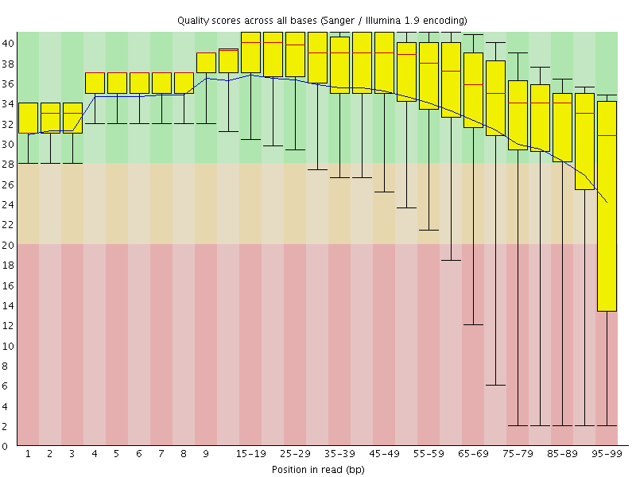
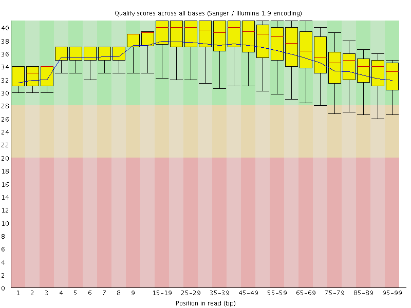

# Create colonCancerWGBS
## Author: Stephanie Hicks

```{r global_options, include=FALSE, echo=FALSE}
knitr::opts_chunk$set(eval=FALSE)
```

#### Overview 
In this tutorial, we will use a set of paired tumor and normal colon whole-genome bisulfite sequencing (WGBS) data. More information about this data is available on GEO ([GSE46644](http://www.ncbi.nlm.nih.gov/geo/query/acc.cgi?acc=GSE46644)). 
Here we cover the steps needed to go from reads (fastq files) to a `bsseq` object which can be loaded into R for downstream analyses such as differential methylation. 

#### Citation 
Ziller MJ, Gu H, Müller F, Donaghey J et al. Charting a dynamic DNA methylation landscape of the human genome. Nature 2013 Aug 22;500(7463):477-81. PMID: [23925113](http://www.ncbi.nlm.nih.gov/pubmed/23925113)


# Obtaining sample information from GEO
The following code chunk obtains the sample information from the series matrix file downloaded from GEO. The columns are then parsed and new columns with shorter names and factor levels are added.

```{r}
library("GEOquery")
gse <- getGEO("GSE46644")
e <- gse[[1]]
pd <- pData(e)
```


```{r}
# subset for colon samples only
pd <- pd[grepl("Colon", pd$title),]
```


The information which connects the sample information from GEO with the SRA run id is downloaded from [SRA](http://www.ncbi.nlm.nih.gov/sra/?term=SRP028600) using the **Send to: File button**. Add the SRA ID to the end of the csv file name. 

```{r}
srr <- read.csv("extdata/SraRunInfo_SRP028600.csv")

srrsmall <- srr[,c("SampleName", "Run", "Experiment", "Sample","BioSample",  "avgLength", "download_path")]
colnames(srrsmall)[which(colnames(srrsmall) == "SampleName")] <- "geo_accession"

# merge the GEO phenotypic information table and the sample information from SRA 
target <- merge(pd, srrsmall, by ="geo_accession")
rownames(target) <- target$Run
```

The SRA names and SRA file paths were saved to help extract the SRA files from NCBI. 
```{r}
write.table(target$Run, file = "extdata/sraFiles.txt", quote= FALSE,row.names = FALSE, col.names = FALSE)
write.table(target$download_path, file = "extdata/sraFilesPath.txt", quote= FALSE,row.names = FALSE, col.names = FALSE)
```


# Obtaining FASTQ files from SRA

#### Downloading individual `.sra` files
Individual `.sra` files can be downloaded using `wget`. 
```{r}
cd <path_to>/sra
wget ftp://ftp-trace.ncbi.nlm.nih.gov/sra/sra-instant/reads/ByRun/sra/SRR/SRR949/SRR949210/SRR949210.sra
```

Downloading all `.sra` files in the `sraFilesPath.txt`: 
```{r}
cd <path_to>/sra
cat ../extdata/sraFilesPath.txt | wget {}
```

#### Extracting `.fastq` files

A file containing the SRA run numbers was created: `sraFiles.txt` (see above). This file was used to extract the paired-end `.fastq` files from the `.sra` files using the `fastq-dump` command in the SRA Toolkit. We use the gnu command `parallel` to parallelize this process. We specify the number of threads to send the individual commands to using the parameter `-j` and here we specify 6 threads.  

```{r}
cd <path_to>/fastq
cat ../extdata/sraFiles.txt | parallel -j 6 fastq-dump -I --split-files ../sra/{}.sra 
```


# Overview of Alignment Workflow

We will use Bismark for the pre-alignment, alignment and post-alignment steps for our WGBS samples. More details can be found at the [Babraham Bioinformatics BS-Seq data processing lecture](http://www.bioinformatics.babraham.ac.uk/training/Methylation_Course/BS-Seq%20theory%20and%20QC%20lecture.pdf).  For more details on the commands, see the [corresponding guide](http://www.bioinformatics.babraham.ac.uk/training/Methylation_Course/Basic%20BS-Seq%20processing%20practical.pdf). 

Steps | Tools | Description 
--- | --- | --- 
Pre-alignment | Fastqc | Initial quality control
Pre-alignment  | Trim Galore | Adapter/quality trimming
Alignment | Bismark | Mapping fastq files; output BAM files 
Post-alignment | Deduplication | optional, but advisable for large genomes and moderate coverage; not appropriate for RRBS
Post-alignment  | Methylation extractor | output cytosine methylation calls; M-bias analysis
Post-alignment  | bismark2report | output graphical HTML report 

# Pre-alignment steps

#### Investigate sequence quality

We use the [`fastqc`](http://www.bioinformatics.babraham.ac.uk/projects/fastqc/) command to get an idea about the sequencing quality of the .fastq files. Using `fastqc` can determine if the reads contain adapter sequences, overrepresented sequences/contaminants, differences between paired-end reads and library complexity.  
```{r}
fastqc *.fastq

# Look at QC report produced by fastqc
firefox SRR949215_1_val_1_fastqc/fastqc_report.html &
```

#### Adapter and quality trimming

We use [`trim_galore`](http://www.bioinformatics.babraham.ac.uk/projects/trim_galore/) to trim the reads to improve mapping efficiency and reduce the chance of misalignments. Use the `--paired` parameter to specify that this was a paired-end experiment. This will remove base calls with a Phred score of 20 or lower, removes adapter sequences, removes sequence pairs where either read became too short as a result of trimming (less than 20 bp) and keeps paired-end sequence pairs in sync. 

```{r, engine='bash'}
cd <path_to>/fastq
cat ../extdata/sraFiles.txt | parallel -j 6 trim_galore --paired \ 
 --fastqc {}\_1.fastq {}\_2.fastq
```

The `--fastqc` parameter re-runs `fastqc` on the trimmed files to compare the quality of the reads before and after trimming.  

Here is an example of the basic summary statistics before and after trimming for sample `SRR949210`: 

Before: 

```{r, engine='bash', eval=TRUE}
cat ../extdata/beforeTrim/fastqc_data.txt | head -10
```

After: 

```{r, engine='bash', eval=TRUE}
cat ../extdata/afterTrim/fastqc_data.txt | head -10
```

and the base quality scores from the first paired-end set of fastq files before and after trimming: 

Before: 



After:




# Alignment and Mapping paired-end reads

We used [`bismark`](http://www.bioinformatics.babraham.ac.uk/projects/bismark/) for the alignments and methylation calling.

First download the human genome file (.fa) from ENSEMBL. 

**Note**: The files need to be unzipped.

```{r}
cd <path_to>/reference/genomes/hsapiens/ENSEMBL/GRCh38/
wget ftp://ftp.ensembl.org/pub/release-79/fasta/homo_sapiens/dna/Homo_sapiens.GRCh38.dna.primary_assembly.fa.gz
gunzip Homo_sapiens.GRCh38.dna.primary_assembly.fa.gz
```

#### Building the bisulfite genome indexes using Bowtie 2
Next, we build the bisulfite genome indexes using Bowtie 2 for the human genome (ENSEMBL GRCh38 build). This process can take several hours.

The `bismark_genome_preparation` command needs to only be once for the genome of interest for bisulfite alignments. This will create two folders within the `/reference/genomes/hsapiens/ENSEMBL/GRCh38/`. Within this folder needs to be a `.fa` or `.fasta` extension (single or multiple entries per file). The two individual folders within this directory are one for a `C->T` converted genome and the other one for the `G->A` converted genome. After creating `C->T` and `G->A` versions of the genome they will be indexed in parallel using the indexer bowtie-build (or bowtie2-build).  The `--bowtie2` parameter will create bisulfite indexes for Bowtie 2 (default is Bowtie 1). 

```{r}
bismark_genome_preparation --bowtie2 <path_to>/reference/genomes/hsapiens/ENSEMBL/GRCh38/
```


#### Using the Bismark read aligner

The paired-end reads for each sample are aligned with Bowtie 2 because it scaled better for longer reads. The parameter `--multicore` is used to speed up the mapping. Here we use 8 cores. The parameter `--bam` writes the output file to a BAM format instead of an uncompressed SAM file. The folder `/reference/genomes/hsapiens/ENSEMBL/GRCh38` contains the bisulfite genome indexes for Bowtie 2 (`--bowtie2`). The `-1` and `-2` parameters correspond to the paired-end `.fastq` files that have been trimmed. 

```{r, engine='bash'}
cd <path_to>/fastq
for f in `cat ../extdata/sraFiles.txt`; do bismark --multicore 8 \ 
 --bowtie2 --bam <path_to>/reference/genomes/hsapiens/ENSEMBL/GRCh38/ \ 
 -1 $f\_val_1.fq -2 $f\_val_2.fq; done
```

Each sample will take many hours (~10-20 hrs depending on the file size). To assess the quality of the alignment, look at the Bismark mapping reports.  For example, the report for the `SRR949215` can be viewed using `cat`. 

```{r, engine='bash'}
cat SRR949215_1_val_1.fq_bismark_bt2_PE_report.txt
```


# Post-alignment steps

#### Extracting methylation calls

The cytosine methylation calls are extracted using the `bismark_methylation_extractor` command for every single C analysed. Several output files will be produced including strand and context specific cytosine output files (CpG, CHG or CHH).  The `--bedGraph` parameter generates coverage files which are useful as input for the R/Bioconductor packge `bsseq` later on. In addition, an M-bias report will be generated and an overall count report. The command `bismark_methylation_extractor` will detect if the input BAM file is for single-end or paired-end (and will set the `-p --no_overlap` parameter for paired-end in our case).  The parameter `--gzip` returns gzipped context specific cytosine output files. 

```{r, engine='bash'}
cd <path_to>/fastq/afterTrim
bismark_methylation_extractor -p --no_overlap --comprehensive \ 
 --multicore 4 --buffer_size 5G --bedGraph --counts --gzip \
 SRR949215_1_val_1.fq_bismark_bt2_pe.bam
```

#### Assessing the alignment

The module `bismark2report` will generate an HTML report from the Bismark alignment, deduplication (if applicable), methylation extraction and M-bias reports. The purpose is to get an idea of the experiment worked.  The command attempts to detect all relevant files in the current working directory (but all files can be optionally listed here). 

```{r}
bismark2report
```


For illustrative purposes, we extract only the methylation loci in chromosome 22 from the `.cov` file. 

```{r, engine='bash'}
for f in `cat ../extdata/sraFiles.txt`; do awk -F"\t" '$1 == "22" { print $0 }' \ 
 $f\_1_val_1.fq_bismark_bt2_pe.bismark.cov > $f.chr22.cov; done
```

This data is available on Github in the [colonCancerWGBS repository](https://github.com/genomicsclass/colonCancerWGBS).

# Session information

```{r, eval=TRUE}
sessionInfo()
```